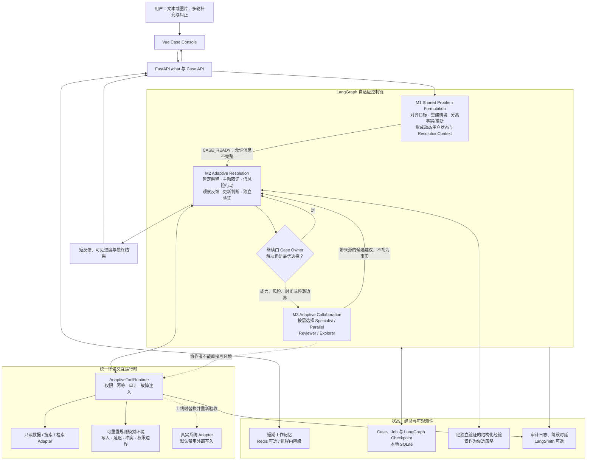

# Concord

Concord 是面向受限理性与有噪声沟通场景的人机协同问题求解系统，采用 Python 后端与 Vue Case Console。

当前公开里程碑：**M8-B**。

项目总纲：**Human behavior provides computational priors for Agent control.** 人类行为研究用于约束 Agent 关注什么、何时深思、何时停止、何时扩大搜索以及何时复用经验，而不是仅用于生成拟人化措辞。

## 目录结构

- `backend/`：Python 模块化单体后端，包含 LangGraph 人机协同问题表征、自适应证据—行动运行时、多 Agent、检索、模拟环境、监控与评测
- `frontend/`：Vue 3 + Vite Case Console，展示 Case 状态、证据、进度与生命周期控制
- `evaluation/`：可复现评测脚本、数据与公开实验结果
- `docs/`：本地私人文档目录，不纳入公开仓库

## 快速入口

- Python 后端：[backend/README.md](backend/README.md)
- 前端：[frontend/README.md](frontend/README.md)
- V2 多轮 Episode 评测：[evaluation/v2_interaction/README.md](evaluation/v2_interaction/README.md)
- 三领域 30 Case 封闭环境基准：[evaluation/v2_interaction/benchmark_30.jsonl](evaluation/v2_interaction/benchmark_30.jsonl)
- 30 场景 × 8 交互条件扩展集：[evaluation/v2_interaction/benchmark_240.jsonl](evaluation/v2_interaction/benchmark_240.jsonl)
- 人类行为可证伪契约：[evaluation/v2_interaction/HUMAN_BEHAVIOR_CONTRACT.md](evaluation/v2_interaction/HUMAN_BEHAVIOR_CONTRACT.md)

运行 Python 后端前，请复制 `backend/.env.example` 为 `backend/.env`，再填入本地密钥。真实 `.env`、依赖目录、构建产物、日志和本地数据不会进入 Git。

当前活动工具链只有一套 `AdaptiveToolRuntime`：真实环境默认只读，写动作在规则驱动的可重置模拟环境中执行，并统一经过权限、幂等、审计、故障注入和独立验证。LangSmith 为可选观测出口，不是运行依赖或事实源。

当前已形成 M1–M8-B 纵向切片：从共享问题表征、闭环解决和动态多 Agent 协作，推进到
可恢复的长期 Case、自适应人机协作，以及只从独立验证结果中保留结构化经验。M7 的经验
只影响候选搜索并要求当前 Case 重新验证；重复失败可以生成隔离评测候选，但生产 Agent
不能自行修改和发布代码、Prompt、Skill 或工具。M8-B 不再增加运行时范式，而是完成
长链实验、故障注入、关键消融、可复现实证和工程证据收口。

## 系统架构



主链路始终由一个 `Primary / Case Owner` 负责。M3 是稀疏触发的协作机制，而不是每个
请求固定调用多个 Agent；协作建议必须返回 M2，经同一工具运行时执行和独立验证后才能
成为当前 Case 的事实。模拟写入与真实 Adapter 共用契约，开发测试不会直接改动外部系统。

## 实验快照

- 真实 `qwen3.8-flash` 纵向实验覆盖 111 条 Episode、7 个领域、10 类故障环境和
  11 种有噪声用户交互状态，最终环境验收为 111/111；其中 100 条解决，11 条正确停在
  人工权限边界。
- 平均时延由早期基线约 180.5 秒降至 130.42 秒，下降 27.7%；中位数 94.90 秒，
  p95 仍为 296.04 秒，因此长尾时延仍是明确边界。
- 预先声明的 20 条子集在完整链路与五个控制组间形成 120 个配对实验单元。
  完整链路为 20/20；固定三 Agent 同为 20/20，但多使用 24 次模型调用且平均慢
  20.82 秒；关闭用户状态、认知分离和失败记忆后分别为 17/20、18/20、17/20。
- 上述数字来自声明式模拟环境和单次随机模型运行，不等同于真实行业成功率或统计因果证明；
  原始 Case、失败样本、逐项差值和排除的基础设施污染均随仓库保留。

## 一键验证与启动

```powershell
# 单元/集成/长任务/故障注入回归 + 公开安全扫描 + Vue 构建
.\scripts\verify.ps1

# 默认使用本地 SQLite 检索索引和进程内工作记忆；后台启动后端与前端
.\scripts\start-dev.ps1

# 同时启动可选 Redis 工作记忆
.\scripts\start-dev.ps1 -WithInfrastructure

# 停止由启动脚本创建的进程
.\scripts\stop-dev.ps1

# 秒级校验已记录的完整纵向证据
.\scripts\demo.ps1

# 对正在运行的后端重新执行真实模型纵向实验（通常需要数分钟）
.\scripts\demo.ps1 -Live
```

M8-B 的架构、调用链、实验结论与边界见
[`M8_B_SHOWCASE.md`](backend/evaluation/m8_productization/M8_B_SHOWCASE.md)，机器可读原始结果位于
[`results/m8_b`](backend/evaluation/m8_productization/results/m8_b/)。公开仓库 CI 会拒绝跟踪
`docs/`、运行时 `.env` 和明显密钥材料。
