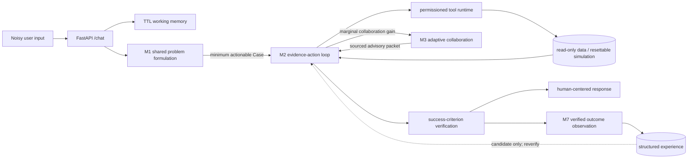
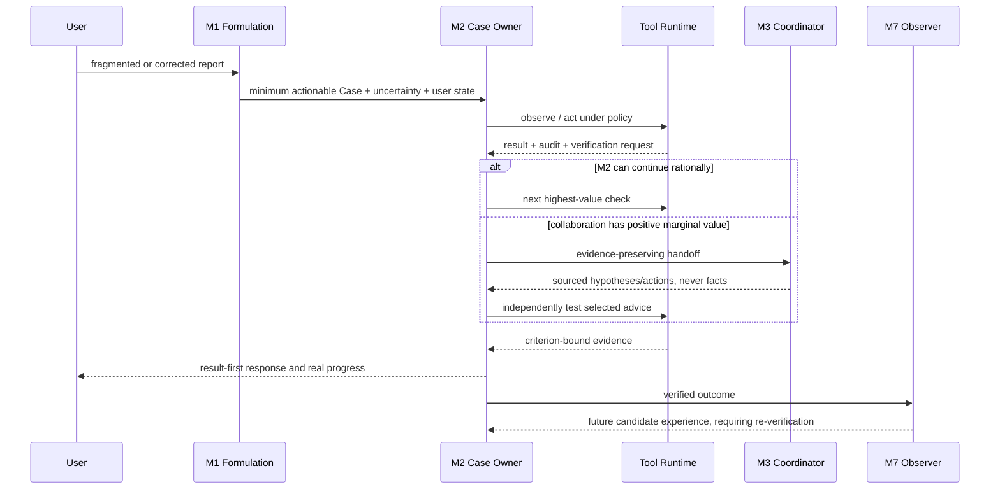

# Concord M8-B — Architecture and Reproducible Evidence

M8-B 是当前学生项目的公开收口版本。它不引入新的 Agent 范式，而是回答三个工程问题：
默认产品链路是否真实贯通、关键机制是否真的进入调用链、失败与边界是否有可复现实验支撑。

## Product architecture



Redis 或进程内 TTL 存储只负责对话连续性；SQLite Case、事件、checkpoint、工具审计和独立验证
才是可恢复事实。历史召回与多 Agent 输出都不是当前事实，必须回到工具运行时验证。

## Active call chain



Detailed producer → consumer evidence is listed in
[`CALL_CHAIN_AUDIT.md`](CALL_CHAIN_AUDIT.md).

## Current real-model evidence

The current artifact uses `qwen3.8-flash` through the public HTTP product boundary. All model clients
were run without inheriting `HTTP_PROXY`, `HTTPS_PROXY` or `ALL_PROXY`.

- Catalog: 31 longitudinal Episodes, 7 domains and 3 user conditions.
- Interaction: 21 three-turn and 10 two-turn Episodes.
- Fault injection: 3 lost-response-after-commit Episodes and 1 retryable-timeout Episode.
- First pass: 30/31 passed. The failed raw run is retained rather than overwritten.
- Structural fixes: M3 plan semantic validation, atomic M3→M2 Case phase, and environment-first
  evidence/retry priority.
- Final merged evidence: 31/31 passed; 28 ended `resolved`, while 3 correctly preserved a human
  permission boundary.
- Mean / median / p95 wall time: 180.48 / 183.10 / 297.11 seconds.
- Total model decisions: 221; total audited tool calls: 162.
- Conditional M3 appeared in 4/31 Cases; it was not forced into ordinary Cases.

The 31/31 result is a preserved 30/31 first pass plus one targeted post-fix rerun, not a claim that a
fresh independent 31-Case repetition was performed. Environment state and tool audit determine PASS;
fluent wording cannot compensate for an unmet goal.

Artifacts:

- [`full/`](results/m8_b/full/) — untouched first pass.
- [`reruns/`](results/m8_b/reruns/) — failure investigation and targeted reruns.
- [`final/`](results/m8_b/final/) — catalog-complete merge with replacement provenance.
- [`comparison/`](results/m8_b/comparison/) — representative mechanism controls.

## Mechanism controls

Four representative Episodes were run across six variants. This is a directional engineering
ablation, not a statistically powered causal study.

| Variant | Passed | Model calls | Tool calls | Mean latency |
|---|---:|---:|---:|---:|
| Full runtime | 4/4 | 32 | 19 | 213.54 s |
| M2 only | 4/4 | 22 | 18 | 150.59 s |
| Fixed collaboration topology | 4/4 | 33 | 21 | 214.29 s |
| No user-state control | 4/4 | 22 | 18 | 149.21 s |
| No epistemic separation | 4/4 | 30 | 21 | 201.86 s |
| No failure memory | 3/4 | 29 | 20 | 240.94 s |

The evidence does not show that M3 improves success on ordinary Cases: M2-only passed this subset
more cheaply. That supports the design objective that collaboration is optional and should be paid
for only when its marginal value is positive. Fixed collaboration incurred only a small extra cost,
so a broad dynamic-M3 efficiency claim would be premature.

Removing user-state control and epistemic separation did not change endpoint success in these four
Cases; outcome-only evaluation is too coarse to establish their value. The no-failure-memory
variant failed the targeted retry Case by stopping at `evidence_required` without verifying the
goal. This clean single rerun is evidence for a failure-memory hypothesis, not population-level
proof. A previous 8,080-second sample crossed a host sleep interval and is preserved but excluded
as infrastructure-invalid.

## Reproducible end-to-end evidence

The selected production-path experiment starts with a self-correcting user report and a retryable tool timeout. It
must preserve the user's goal, remember the failed direction, recruit collaborators only after M2
stalls, consume sourced advice in M2, independently verify the environment and record a verified
outcome. The recorded run took 381.46 seconds, used 3 user turns, 14 model calls and 7 audited tool
calls. It recruited `alternative_explorer` and `operations_planner`.

Fast evidence replay:

```powershell
.\scripts\demo.ps1
```

Live model run against an already started evaluation-enabled backend:

```powershell
.\scripts\demo.ps1 -Live
```

The fast path validates the checked-in raw artifact; the live path creates a new ignored artifact and
also checks local SQLite for retained verified experience.

## Interpretation boundary

- The results establish the checked-in simulated contracts, not universal competence in seven real
  industries.
- Three user conditions are useful longitudinal stressors, not a representative human population.
- The mean latency is far above an interactive product target; correctness currently comes before
  responsiveness.
- Dynamic collaboration is optional. If M2 independently solves and verifies a Case, skipping M3 is
  correct behavior.
- The ablation is a four-Episode mechanism study; its one-Case differences are hypotheses for
  repetition, not statistically powered causal claims.
- Real production adapters still require organization-specific authorization, audit retention,
  incident procedures and integration tests.

## Reproduction

```powershell
# Terminal 1
cd backend
$env:CONCORD_ENABLE_EVALUATION_VARIANTS = "true"
python main.py

# Terminal 2: complete catalog
cd backend
python -m evaluation.m4_end_to_end `
  --base-url http://127.0.0.1:8000 `
  --concurrency 8 `
  --output-dir evaluation/m8_productization/results/m8_b/new-run

# Deterministic product checks
cd ..
.\scripts\verify.ps1
```
