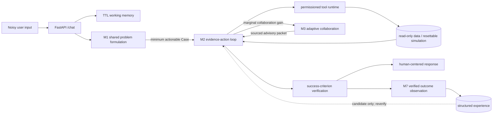
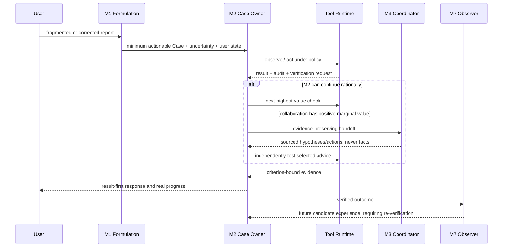

# Concord M8-B — Architecture and Reproducible Evidence

M8-B 是当前学生项目的公开收口版本。它不引入新的 Agent 范式，而是回答三个工程问题：
默认产品链路是否真实贯通、关键机制是否真的进入调用链、失败与边界是否有可复现实验支撑。

## Product architecture



Redis 或进程内 TTL 存储只负责对话连续性；SQLite Case、事件、checkpoint、工具审计和独立验证
才是可恢复事实。历史召回与多 Agent 输出都不是当前事实，必须回到工具运行时验证。

## Active call chain



Detailed producer → consumer evidence is listed in
[`CALL_CHAIN_AUDIT.md`](CALL_CHAIN_AUDIT.md).

## Current real-model evidence

The current artifact uses `qwen3.8-flash` through the public HTTP product boundary. All model clients
were run without inheriting `HTTP_PROXY`, `HTTPS_PROXY` or `ALL_PROXY`.

- Catalog: 111 longitudinal Episodes covering 7 domains, 10 declared fault environments and
  11 noisy user-interaction conditions, plus one complete vertical Episode.
- Interaction: average 2.35 user turns; 107/111 Cases reached M2 on the first turn rather than
  waiting for an artificially complete M1 record.
- Final merged evidence: 111/111 passed; 100 ended `resolved`, while 11 correctly preserved a human
  permission boundary.
- Mean / median / p95 wall time: 130.42 / 94.90 / 296.04 seconds. Mean latency is 27.7% below the
  earlier 31-Episode artifact, while the long tail remains visible.
- Total model decisions: 722; total audited tool calls: 583.
- Conditional M3 appeared in 15/111 Cases; it was not forced into ordinary Cases.
- Mean post-formulation time to the first tool call was 4.60 seconds.

The final 111/111 artifact contains one targeted replacement after the runtime let a model invent an
undeclared simulation action. The pre-fix raw evidence is retained under `failure_evidence`; the fix
requires action identifiers to come from successful affordance discovery. This is not presented as a
fresh independent repetition. Environment state and tool audit determine PASS; fluent wording cannot
compensate for an unmet goal.

Artifacts:

- [`expanded/final_batched/`](results/m8_b/expanded/final_batched/) — 111-Case merged outcome
  artifact and report.
- [`expanded/failure_evidence/`](results/m8_b/expanded/failure_evidence/) — preserved pre-fix run.
- [`expanded/comparison_20/`](results/m8_b/expanded/comparison_20/) — 20 paired Episodes across
  the full runtime and five controls, including excluded infrastructure evidence.
- [`full/`](results/m8_b/full/) — earlier 31-Episode baseline retained for provenance.

## Mechanism controls

Twenty predeclared Episodes were compared across the full runtime and five variants: 120 paired
experiment cells. The full-runtime rows reuse the corresponding 20 Cases from the 111-Case run;
the five controls add 100 real-model runs.

| Variant | Passed | Model calls | Tool calls | Mean latency |
|---|---:|---:|---:|---:|
| Full runtime | 20/20 | 131 | 106 | 118.44 s |
| M2 only | 17/20 | 129 | 98 | 143.80 s |
| Fixed collaboration topology | 20/20 | 155 | 111 | 139.26 s |
| No user-state control | 17/20 | 156 | 108 | 164.96 s |
| No epistemic separation | 18/20 | 143 | 105 | 156.46 s |
| No failure memory | 17/20 | 144 | 110 | 130.68 s |

On this subset, dynamic collaboration preserved the same 20/20 endpoint success as fixed-three while
using 24 fewer model calls and lowering mean latency by 20.82 seconds. M2-only saved eight tool calls
but failed three Cases, including the specialist-recovery boundary. This supports sparse M3 as a
fallback, not mandatory multi-Agent fan-out.

Removing user-state control, epistemic separation or failure memory reduced endpoint success by
3, 2 and 3 Cases respectively and generally increased decision cost. These are paired engineering
observations, not statistically powered causal estimates: each variant was run once with a stochastic
model, and all outcomes are grounded in declared simulated environments. The raw per-Episode deltas
and stratified slices remain public so the aggregate cannot hide counterexamples.

Two initial control files were excluded after concurrent Case creation exposed SQLite lock contention.
They are preserved under `invalid_infrastructure`; the active rows were rerun against an isolated
database after adapters sharing one SQLite path received a common process-local access coordinator,
WAL and a bounded busy timeout.

## Reproducible end-to-end evidence

The selected production-path experiment starts with a self-correcting user report and a retryable tool timeout. It
must preserve the user's goal, remember the failed direction, recruit collaborators only after M2
stalls, consume sourced advice in M2, independently verify the environment and record a verified
outcome. The recorded run took 381.46 seconds, used 3 user turns, 14 model calls and 7 audited tool
calls. It recruited `alternative_explorer` and `operations_planner`.

Fast evidence replay:

```powershell
.\scripts\demo.ps1
```

Live model run against an already started evaluation-enabled backend:

```powershell
.\scripts\demo.ps1 -Live
```

The fast path validates the checked-in raw artifact; the live path creates a new ignored artifact and
also checks local SQLite for retained verified experience.

## Interpretation boundary

- The results establish the checked-in simulated contracts, not universal competence in seven real
  industries.
- Eleven user conditions are useful longitudinal stressors, not a representative human population.
- Mean latency improved to 130.42 seconds, but p95 remains 296.04 seconds and is still above an
  interactive product target.
- Dynamic collaboration is optional. If M2 independently solves and verifies a Case, skipping M3 is
  correct behavior.
- The ablation contains 20 paired Episodes per variant, but one stochastic run per cell is still not
  a statistically powered causal study.
- Real production adapters still require organization-specific authorization, audit retention,
  incident procedures and integration tests.

## Reproduction

```powershell
# Terminal 1
cd backend
$env:CONCORD_ENABLE_EVALUATION_VARIANTS = "true"
python main.py

# Terminal 2: complete catalog
cd backend
python -m evaluation.m4_end_to_end `
  --base-url http://127.0.0.1:8000 `
  --concurrency 4 `
  --batch-size 4 `
  --output-dir evaluation/m8_productization/results/m8_b/new-run

# Deterministic product checks
cd ..
.\scripts\verify.ps1
```
